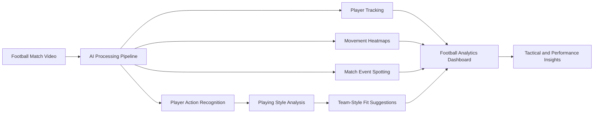
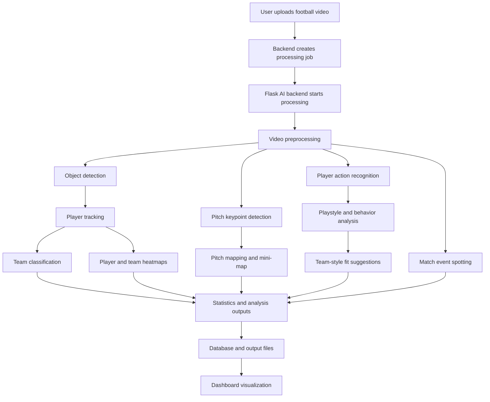
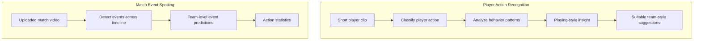
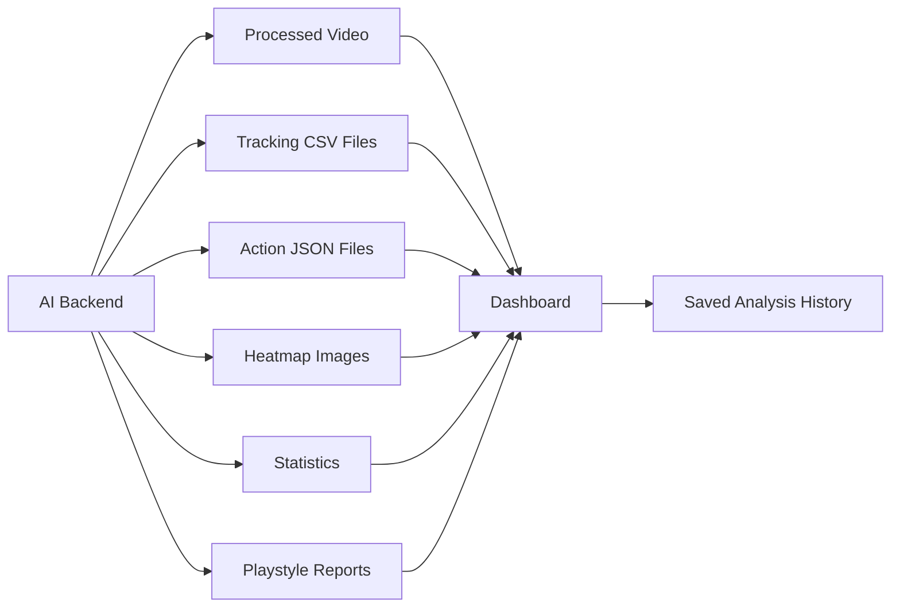

# Goalithm

**Goalithm** is an AI-powered football analytics platform that transforms raw football match videos into clear tactical, performance, and player-style insights.

The platform combines **Computer Vision**, **Deep Learning**, and a full-stack web dashboard to help coaches, analysts, scouts, and teams review player tracking, heatmaps, match events, player actions, playing styles, tactical fit, and analysis history in one place.

Goalithm was built to reduce manual football video analysis and turn match footage into structured football intelligence.

---

## System at a Glance



---

## My Contribution

I contributed to the AI/ML pipeline and the integration of football video analysis outputs into the final dashboard workflow.

My work focused on:

* Supporting the football video analysis pipeline.
* Working on player detection, tracking, and movement analysis.
* Supporting team classification and player/team separation.
* Generating player and team heatmaps from tracking data.
* Working on action analysis and match event outputs.
* Supporting player playing-style and team-style compatibility insights.
* Integrating AI backend results with the web dashboard.
* Helping transform raw football videos into tactical and performance insights for coaches, analysts, and scouts.

### Contribution Note

The project was mainly developed through a shared local team setup before being organized and uploaded to GitHub. Because of that, the commit history may not fully represent each member’s individual contribution. My contribution above summarizes the actual AI/ML and system integration work I was involved in during the project.

---

## Key Features

* Upload football match videos for AI analysis.
* Detect players, goalkeepers, referees, and the ball.
* Track players across video frames using unique tracking IDs.
* Classify players into teams based on kit appearance.
* Generate player and team movement heatmaps.
* Generate mini-map visualization using pitch mapping.
* Display player and team positioning statistics.
* Analyze match events and action outputs.
* Recognize player actions from short football clips.
* Analyze player playing style and behavior patterns.
* Suggest suitable team playing styles that may fit the player.
* Save projects, processing jobs, outputs, and analysis history.
* Review results through a structured web dashboard.

---

## How Goalithm Works

Goalithm is not just a video upload system. Each uploaded video passes through several AI and computer vision stages before the final insights are displayed.



---

## AI Pipeline

### 1. Object Detection

A YOLO-based model detects the main football objects in each frame:

* Players
* Goalkeepers
* Referees
* Ball

The detection output includes bounding boxes, class labels, and confidence scores. These results are used by the next stages of the pipeline.

### 2. Player Tracking

After detection, players are tracked across frames using a multi-object tracking approach.

Each player receives a unique tracking ID, allowing the system to follow player movement over time and generate movement-based analysis such as trajectories, positioning statistics, and heatmaps.

### 3. Team Classification

Detected players are grouped into teams based on visual similarity, mainly shirt/kit color.

This helps separate both teams visually and supports team-based statistics, heatmaps, and action analysis.

### 4. Ball Detection Support

The ball is difficult to detect because it is small, fast, and often blurry.

The AI backend includes support techniques such as frame tiling to improve ball detection in wide match footage.

### 5. Pitch Mapping and Mini-map

A pitch/keypoint detection model identifies important football field landmarks.

These keypoints help map player positions from the camera view to a top-down pitch view, enabling mini-map visualization and better spatial analysis.

### 6. Heatmap Generation

Heatmaps are generated from real tracking coordinates.

The system supports:

* Player heatmaps
* Team heatmaps

These heatmaps show the most active areas for players or teams and help analyze movement behavior, positioning, and tactical presence.

### 7. Player Action Recognition and Playstyle Analysis

Goalithm includes a player-level action recognition model that analyzes short football clips and predicts the action performed by the player.

This part adds a deeper layer of analysis because the system does not only track where the player moved, but also helps understand what the player did and how they tend to play.

Based on detected actions and behavior patterns, the system supports:

* Player action classification.
* Player playing-style understanding.
* Player behavior analysis.
* Tactical fit between the player and suitable team styles.
* Better player evaluation for coaching and scouting decisions.

This makes Goalithm closer to a virtual football analyst, because it connects player actions with tactical interpretation.

### 8. Match Event Spotting

Goalithm also includes a match event spotting workflow for detecting team-level football events from uploaded videos.

Unlike player action recognition, which focuses on short player clips, match event spotting analyzes the video timeline and returns event predictions and statistics.

The match event spotting screen sends the uploaded video to the Flask AI backend endpoint:

```text
POST /ball_action_video
```

This workflow uses the ball-action model:

```text
backend/Ai/ball_model_FULL_OBJECT.pt
```

Generated files include:

```text
<job_id>_ball_action_predictions.json
<job_id>_ball_action_events.jsonl
```

---

## Action Recognition vs Match Event Spotting

Goalithm uses both action recognition and match event spotting, but each one has a different role.



| Module                    | Input             | Output                            | Main Purpose                                             |
| ------------------------- | ----------------- | --------------------------------- | -------------------------------------------------------- |
| Player Action Recognition | Short player clip | Player action + playstyle insight | Understand what the player did and how they tend to play |
| Match Event Spotting      | Match video       | Event predictions and statistics  | Understand what happened across the match timeline       |

---

## Output Flow

The AI backend generates different outputs depending on the selected analysis type.



Generated outputs can include:

```text
processed videos
tracking CSV files
player position CSV files
ball position CSV files
frame state CSV files
event/action JSON files
heatmap images
action prediction JSON files
playstyle and tactical-fit reports
```

---

## Project Structure

```text
.
+-- frontend/                  Angular dashboard UI
+-- backend/
|   +-- SA/SA/                 ASP.NET Core API, authentication, database, history, statistics
|   +-- Ai/                    Flask AI backend and model inference code
|   +-- requirements.txt       Python dependencies
+-- README.md
```

---

## Tech Stack

### AI / Computer Vision

* Python
* YOLO / Ultralytics
* OpenCV
* ByteTrack
* TensorFlow / Keras
* PyTorch
* NumPy
* Pandas
* Supervision
* Roboflow Sports utilities

### Backend

* ASP.NET Core
* C#
* Flask
* REST APIs
* JWT Authentication
* SQL Database

### Frontend

* Angular
* TypeScript
* HTML
* CSS

---

## Local Services

| Service          | Default URL             | Purpose                                                        |
| ---------------- | ----------------------- | -------------------------------------------------------------- |
| Angular frontend | `http://localhost:4200` | Dashboard UI                                                   |
| ASP.NET API      | `http://localhost:5067` | Authentication, users, projects, history, and saved statistics |
| Flask AI API     | `http://localhost:5050` | Video processing and AI model inference                        |

The frontend API URLs are configured in:

```text
frontend/src/environments/environment.ts
```

---

## Required Model Files

Model files are not committed to Git because they are large.

Before running the AI backend, place the required model files inside:

```text
backend/Ai/
```

Required files:

```text
backend/Ai/best.pt
backend/Ai/yolo-football-pitch-detection.pt
backend/Ai/ball_model_FULL_OBJECT.pt
backend/Ai/sen_best_model_4.keras
```

| Model File                         | Purpose                                  |
| ---------------------------------- | ---------------------------------------- |
| `best.pt`                          | Football object detection model          |
| `yolo-football-pitch-detection.pt` | Pitch/keypoint detection model           |
| `ball_model_FULL_OBJECT.pt`        | Ball action / match event spotting model |
| `sen_best_model_4.keras`           | Player action recognition model          |

Runtime outputs are written under:

```text
backend/Ai/outputs/
```

This folder is ignored by Git.

---

## Environment Configuration

A local `.env` file can be used for development, but it is ignored and must not be committed.

Example values:

```env
JWT_SECRET=AI-Sports-Analytics-Development-JWT-Secret-Change-Me-2026
JWT_ISSUER=AI Sports Analytics
JWT_AUDIENCE=AI Sports Analytics Frontend

ASPNETCORE_ENVIRONMENT=Development
ASPNETCORE_URLS=http://localhost:5067
ConnectionStrings__DefaultConnection=Server=localhost\SQLEXPRESS;Database=SportsAnalyticsDB;Trusted_Connection=True;TrustServerCertificate=True;

DOTNET_API_BASE=http://localhost:5067

# Optional AI CSV behavior
# SKIP_FULL_EVENT_CSV=1
# ENABLE_FULL_EVENT_CSV=1
```

Important:

The same JWT settings must be used by both the ASP.NET API and the Flask AI backend. If the settings are different, authenticated AI requests may fail.

---

## Install Dependencies

### Frontend

```powershell
cd frontend
npm install
```

### ASP.NET API

```powershell
dotnet restore backend\SA\SA\SA.csproj
dotnet build backend\SA\SA\SA.csproj
```

### Flask AI Backend

```powershell
cd backend\Ai
python -m pip install -r ..\requirements.txt
```

---

## Run Locally

### 1. Start the ASP.NET API

```powershell
dotnet run --project backend\SA\SA\SA.csproj --urls http://localhost:5067
```

### 2. Start the Flask AI Backend

```powershell
cd backend\Ai
python app.py
```

Or use:

```powershell
backend\Ai\start_server.bat
```

### 3. Start the Angular Frontend

```powershell
cd frontend
npm start
```

Open the dashboard:

```text
http://localhost:4200
```

---

## Main Workflow

1. User logs in.
2. User uploads a football video.
3. Backend creates a processing job.
4. Flask AI backend starts video processing.
5. AI models detect and track football objects.
6. Team classification, pitch mapping, heatmaps, actions, playstyle insights, and event outputs are generated.
7. Results are saved as videos, CSV files, JSON files, images, reports, and database records.
8. Frontend polls job status until processing is complete.
9. User reviews the processed video, statistics, heatmaps, analytics, playstyle insights, and history.

---

## Git Notes

The repository ignores local secrets, generated outputs, build artifacts, dependency folders, uploaded videos, and large model files.

Do not commit:

```text
.env
backend/Ai/outputs/
node_modules/
frontend/dist/
*.pt
*.pth
*.onnx
*.keras
*.h5
```

If model files need to be versioned later, use Git LFS or a separate release/download process.

---

## Current Limitations

* Processing speed depends heavily on GPU power.
* Ball detection is challenging because the ball is small and fast.
* Tracking can be affected by occlusion, camera movement, and crowded scenes.
* Team classification can be affected when team kits look similar.
* Heatmap accuracy depends on tracking quality and pitch keypoint stability.
* Action spotting currently focuses on selected event classes.
* Player action recognition and playstyle insights depend on clip quality and available context.

---

## Future Improvements

* Improve ball detection and tracking.
* Add player re-identification.
* Add jersey number recognition.
* Expand action recognition and action spotting classes.
* Improve support for long full-match videos.
* Add more advanced tactical reports.
* Expand player playing-style reports and improve team-style compatibility suggestions with more tactical patterns and larger datasets.
* Optimize the system for near real-time processing.

---

## Summary

Goalithm is an end-to-end AI football analytics platform that connects trained AI models with a practical dashboard experience.

It starts from uploaded football videos and produces structured insights such as tracking outputs, heatmaps, mini-map views, player/team statistics, action predictions, playing-style analysis, team-style compatibility suggestions, and analysis history.

The project brings AI, Computer Vision, backend engineering, and frontend visualization together to support football analysis in a clear and practical way.
