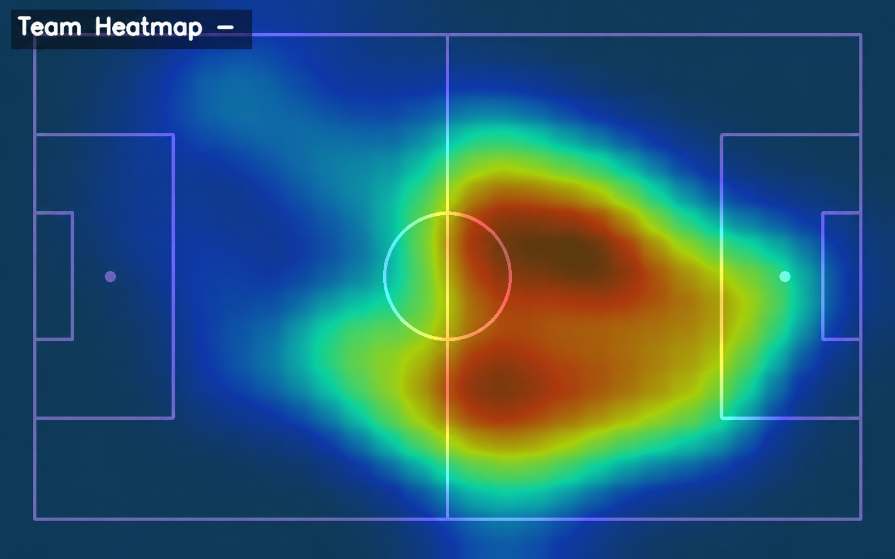
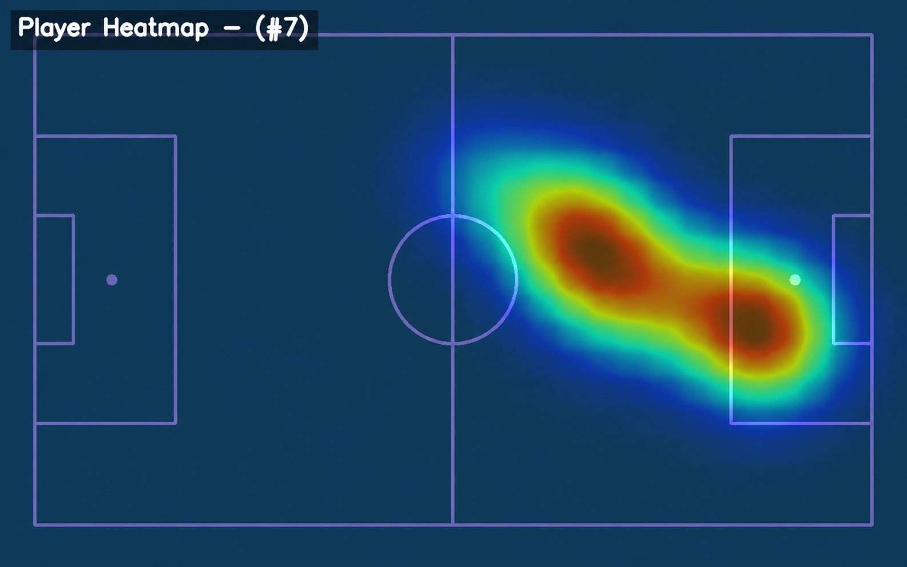
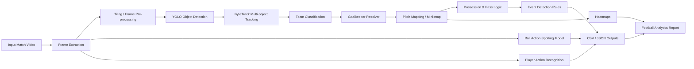

# Goalithm — AI Football Video Analysis Pipeline

Goalithm is an AI-powered football analytics project focused on transforming raw football match videos into structured tactical and performance insights using Computer Vision, Deep Learning, object detection, multi-object tracking, event logic, heatmaps, and player action recognition.

This repository highlights the **AI pipeline only**: models, modules, logic rules, video processing, event detection, heatmap generation, action spotting, and generated analysis outputs.

---
## My Contribution
I contributed to the AI/ML pipeline and the integration of football video analysis outputs into the final dashboard workflow.

**My work focused on:**

- Supporting the football video analysis pipeline.
- Working on player detection, tracking, and movement analysis.
- Supporting team classification and player/team separation.
- Generating player and team heatmaps from tracking data.
- Working on action analysis and match event outputs.
- Supporting player playing-style and team-style compatibility insights.
- Integrating AI backend results with the web dashboard.
- Helping transform raw football videos into tactical and performance insights for coaches, analysts, and scouts.
### Contribution Note
The project was mainly developed through a shared local team setup before being organized and uploaded to GitHub. Because of that, the commit history may not fully represent each member’s individual contribution. My contribution above summarizes the actual AI/ML and system integration work I was involved in during the project.

## Demo

> Add short GIFs inside the `assets/` folder to make the repository easier to understand visually.

### Player Detection & Tracking


### Heatmap Generation





---

## AI Pipeline Overview



---

## What the AI System Does

Goalithm analyzes football videos through multiple AI and logic modules:

- Detects players, ball, referees, and goalkeepers.
- Tracks players across frames using multi-object tracking.
- Classifies players into teams based on visual appearance.
- Resolves goalkeeper team assignment.
- Maps player movement into pitch coordinates.
- Generates player movement heatmaps.
- Produces mini-map visualizations.
- Estimates possession and team control.
- Detects football events using rule-based logic over tracking and possession signals.
- Spots ball-related match actions from video.
- Reviews player clips and recognizes player actions.
- Supports player behavior and playing-style analysis.
- Exports structured outputs such as CSV, JSON, JSONL, heatmaps, and processed videos.

---

## Core AI Modules

| Module | File | Purpose |
|---|---|---|
| Football Analyzer | `backend/Ai/module/football_analysis.py` | Main orchestrator that combines detection, tracking, team classification, possession, heatmaps, mini-map, saving, and event detection. |
| Frame Processing | `backend/Ai/module/frame_processing.py` | Handles frame-level detection and processing operations. |
| Tiling | `backend/Ai/module/tiling.py` | Splits or processes frames to improve detection quality on football footage. |
| Team Classification | `backend/Ai/module/team_classification.py` | Classifies tracked players into teams. |
| Goalkeeper Classification | `backend/Ai/module/goalkeeper_classification.py` | Assigns goalkeeper identity/team when standard team classification is not enough. |
| Possession Logic | `backend/Ai/module/possession.py` | Estimates ball control, possession gains, possession losses, and team control states. |
| Event Detection | `backend/Ai/module/event_detection.py` | Converts tracking and possession signals into football events using rule-based logic. |
| Heatmap Generator | `backend/Ai/module/heat_map.py` | Generates movement-density heatmaps from player coordinates. |
| Mini-map | `backend/Ai/module/mini_map.py` | Visualizes player locations on a simplified pitch view. |
| Action Recognition | `backend/Ai/module/action_recognition.py` | Recognizes player actions from video clips. |
| Player Review | `backend/Ai/module/Review-player.py` | Reviews player behavior/action clips for player-level analysis. |
| Saver | `backend/Ai/module/saver.py` | Saves processed outputs, logs, CSV files, JSON files, and generated media. |

---

## Models Used

The large model files are not committed to GitHub. Place them manually inside `backend/Ai/` before running the AI pipeline.

| Model File | Role |
|---|---|
| `best.pt` | Main football object detection model. |
| `yolo-football-pitch-detection.pt` | Football pitch/keypoint detection model used for pitch understanding and mapping. |
| `ball_model_FULL_OBJECT.pt` | Ball-action / match-event spotting model. |
| `sen_best_model_4.keras` | Player action recognition model used for player review and behavior analysis. |

---

## AI Logic Details

### 1. Object Detection

The detection model processes football frames and detects important match objects such as players, ball, referees, and goalkeepers. These detections become the base input for the rest of the pipeline.

### 2. Multi-object Tracking

After detection, the system uses tracking to preserve player identities across frames. This allows the pipeline to follow each player over time instead of treating each frame independently.

### 3. Team Classification

Tracked players are classified into teams using visual features. This enables team-based statistics, possession estimation, and tactical interpretation.

### 4. Goalkeeper Resolver

Goalkeepers can look visually different from outfield players, so the system includes a dedicated goalkeeper handling module to assign goalkeepers to the correct team.

### 5. Pitch Mapping and Mini-map

The system maps movement into a pitch-based representation, allowing player locations and movement patterns to be visualized more clearly through a mini-map.

### 6. Possession and Pass Logic

The possession module uses ball proximity, control zones, previous control states, and transition rules to estimate which player or team is controlling the ball. This supports pass and possession analysis.

### 7. Event Detection Rules

The event detection module uses tracking data, ball movement, possession gains/losses, speed changes, and player/team transitions to infer football events such as passes, crosses, interceptions, shots, and goalkeeper saves.

### 8. Heatmap Generation

Player positions are collected over time and converted into heatmaps that show movement density and tactical positioning.

### 9. Action Spotting

The ball-action spotting path detects important ball-related match actions and exports prediction results in structured JSON/JSONL files.

### 10. Player Action Recognition

The player review/action recognition path analyzes player clips and identifies action patterns that can support player behavior and playing-style analysis.

---

## Output Examples

The AI pipeline can generate:

```text
backend/Ai/outputs/
│
├── processed_video.mp4
├── tracking_results.csv
├── player_positions.csv
├── ball_positions.csv
├── frame_states.csv
├── possession_control.csv
├── detected_events.csv
├── heatmap.png
├── mini_map_output.mp4
├── <job_id>_ball_action_predictions.json
└── <job_id>_ball_action_events.jsonl
```

---

## Recommended Repository Assets

Create an `assets/` folder and add the following visuals:

```text
assets/
│
├── demo-player-tracking.gif
├── demo-heatmap.gif
├── demo-action-spotting.gif
├── demo-player-review.gif
├── ai-pipeline-overview.png
├── sample-tracking-frame.png
├── sample-heatmap.png
├── sample-minimap.png
└── sample-events-json.png
```

### How to create GIFs from output videos

Use FFmpeg:

```bash
ffmpeg -i output_tracking.mp4 -ss 00:00:02 -t 8 -vf "fps=10,scale=900:-1:flags=lanczos" assets/demo-player-tracking.gif
```

For heatmap or action spotting demos:

```bash
ffmpeg -i heatmap_output.mp4 -ss 00:00:01 -t 6 -vf "fps=10,scale=900:-1:flags=lanczos" assets/demo-heatmap.gif
```

Keep GIFs short, clear, and under 10 MB when possible.

---

## Project Structure

```text
backend/Ai/
│
├── app.py
├── start_server.bat
├── ball_action_model_config.json
├── using.ipynb
│
├── module/
│   ├── football_analysis.py
│   ├── frame_processing.py
│   ├── tiling.py
│   ├── team_classification.py
│   ├── goalkeeper_classification.py
│   ├── possession.py
│   ├── event_detection.py
│   ├── heat_map.py
│   ├── mini_map.py
│   ├── action_recognition.py
│   ├── Review-player.py
│   └── saver.py
│
└── src/
    └── models/
```

---

## Installation

Install the AI/backend Python requirements:

```bash
cd backend/Ai
python -m pip install -r ../requirements.txt
```

Main Python dependencies include:

- Flask
- Flask-CORS
- Ultralytics
- OpenCV
- Supervision
- NumPy
- Pandas
- PyTorch
- Torchvision
- Keras
- JAX
- Roboflow Sports package

---

## Running the AI Service

From the AI backend directory:

```bash
cd backend/Ai
python app.py
```

Or on Windows:

```bash
backend\Ai\start_server.bat
```

The AI service handles video-processing requests, model inference, event detection, and output generation.

---

## Important Notes

- Large model files are intentionally not committed to GitHub.
- Runtime outputs are ignored and should not be pushed.
- Video uploads, generated CSV/JSON files, processed videos, and model weights should stay local or be shared through external storage.
- The repository focuses on the AI pipeline and model logic; frontend/backend UI details are not the focus of this README.

---

## Why Goalithm Matters

Manual football video analysis takes time and requires repeated review from coaches and analysts. Goalithm reduces that manual effort by turning match videos into structured AI-generated insights, helping with tactical analysis, performance review, player evaluation, and data-driven scouting.

---

## Project Status

Goalithm is a graduation project prototype demonstrating how Computer Vision and Deep Learning can be applied to football match understanding through an integrated AI video-analysis pipeline.
